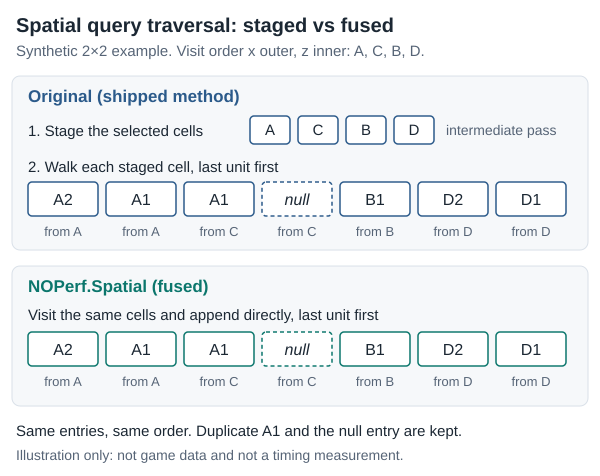
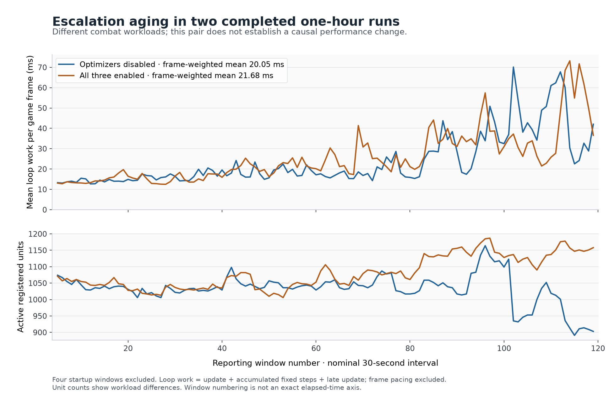

# NOPerf: Nuclear Option server performance mods

NOPerf is a set of optional, independent [BepInEx 5](https://docs.bepinex.dev/)
plugins for the **Linux dedicated server** of Nuclear Option. They run on the
server only and target one exact tested build:

- Nuclear Option **0.34.1**, Steam build **24724541**, game build `cb745d6c44f1`
- BepInEx 5.4.23.3 (Linux)

On any other game assembly the plugins stay inactive and the original game
code runs unchanged. Install only the plugins you want. Each one loads and is
configured on its own.

**[Read the interactive test report](https://clankagent.github.io/noperf/)** ·
**[See how the Spatial query works (step-through animation)](https://clankagent.github.io/noperf/how-it-works.html)** ·
**[Download v0.1.0](https://github.com/clankagent/noperf/releases/tag/v0.1.0)**

> [!IMPORTANT]
> **What has not been shown.** Method benchmarks improved, but **no whole-server
> speedup has been established**. Mission comparisons stayed within run-to-run
> variation and are inconclusive. **Joining and rejoining with an unmodded
> (vanilla) client has not been live-tested.** These plugins make no FPS or
> player-capacity claim.

## The plugins

| Plugin | Default | What it changes | Method evidence | Whole-server effect |
|---|---|---|---|---|
| `NOPerf.Spatial` | On | Fuses the battlefield unit-grid query traversal straight into the output list. Cell bounds, cell order, reverse unit order, duplicates and nulls are preserved. | About 28–33% less method time in game-Mono benchmarks | Not established |
| `NOPerf.Wrecks` | Off, experimental | Reuses a wreck collector's temporary candidate snapshot within a guarded search. | 0.9–3.5% at 128 candidates, fewer GC collections. Empty searches add 0.006–0.65 µs. Depends on workload. | Unproven |
| `NOPerf.Navigation` | Off, experimental | Caches road-node membership checks. Original sorting and route decisions are kept. | 6–13% on synthetic road graphs | Unproven. Pathfinding was sparse in the measured missions. |
| `NOPerf.Diagnostics` | Off | Logs the game's existing frame timing, heap and GC counters. Method and phase probes are opt-in. | Not an optimization. It adds overhead. | n/a |

Each percentage comes from its own benchmark and input. Compare within a row,
not across rows.

No plugin changes simulation rates, physics settings, RNG calls, AI update
cadence, sensor coverage, target-selection rules, network messages or mission
content.

## How Spatial works

<p align="center">
  
</p>

The shipped query first collects the selected grid cells and then walks each
cell's unit list backwards. `NOPerf.Spatial` keeps the same cell rectangle
(including its exclusive upper bounds), the same `x`-outer/`z`-inner visit order
and the same reverse index loop. It appends each unit as it goes, which removes
the intermediate cell pass. Nothing is filtered by distance. The output keeps
whatever the game's selected cells contain, including duplicates and `null`
entries.

The diagram is a synthetic illustration, not game data or a timing. The
[mechanism page](https://clankagent.github.io/noperf/how-it-works.html) steps
through the same example one entry at a time. It also explains the Wrecks and
Navigation changes.

## Results

**Method benchmarks** ran in the game's own Mono runtime. They compared each
plugin against Harmony reverse patches of the shipped method. The results are
the percentages in the table above.

**Mission runs** used offline Escalation auto-hosting with no players connected:

- Four ten-minute baseline/Spatial comparisons gave loop means of
  14.044/14.026 ms and 14.430/13.999 ms per game frame. Both differences (about
  0.1% and 3.0%) are within the variation between baseline runs.
- In one hour-long pair, the run with all three optimizers had a higher overall
  mean (21.68 vs 20.05 ms) but a lower final segment (37.15 vs 38.80 ms). Unit
  counts and combat workloads differed, so this pair shows neither a gain nor a
  regression.
- In an unoptimized profile, the unit-grid query cost roughly 0.031 ms per game
  frame. That small share limits how much a faster query can change total loop
  time in this workload.

<p align="center">
  
</p>

*Both hour-long Escalation runs slowed sharply late in the mission. Blue: all
optimizers disabled. Orange: all three enabled. The runs had different combat
workloads and unit counts (lower panel), so this pair does not establish a
causal gain or regression. "Loop work" is the game's update + accumulated fixed
update + late update per game frame. It is not FPS and excludes frame pacing.
Windows are nominal 30-second intervals, and four startup windows are excluded.*

The [report](https://clankagent.github.io/noperf/) has interactive charts and
the late-mission physics breakdown. It keeps three units of measure apart:
sampled method costs, cost per physics step and accumulated cost per game frame.

## Install

Requirements: the Linux dedicated server at the exact build above, and
BepInEx 5 for Linux.

1. Install BepInEx 5 into the server folder. Run the server once so
   `BepInEx/config/BepInEx.cfg` is created, then stop it.
2. In `BepInEx/config/BepInEx.cfg`, set:

   ```ini
   [Chainloader]
   HideManagerGameObject = true
   ```

   With the default value, the tested build did not run the plugins' later
   lifecycle callbacks.
3. Download the plugin archive from the
   [v0.1.0 release](https://github.com/clankagent/noperf/releases/tag/v0.1.0).
   Copy **only the DLLs you want** into `BepInEx/plugins/`:
   - `NOPerf.Spatial.dll`
   - `NOPerf.Wrecks.dll`
   - `NOPerf.Navigation.dll`
   - `NOPerf.Diagnostics.dll`
4. Start the server. Each loaded plugin creates its own config file in
   `BepInEx/config/`.
5. To change whether a plugin is enabled, edit `[General] Enabled` in its
   config file and **restart the server**. Patch enablement is read only at
   startup.

| Config file | Default `Enabled` | Other settings |
|---|---|---|
| `agent.noperf.spatial.cfg` | `true` | — |
| `agent.noperf.wrecks.cfg` | `false` | — |
| `agent.noperf.navigation.cfg` | `false` | — |
| `agent.noperf.diagnostics.cfg` | `false` | `[General] IntervalSeconds` (30, range 5–300). `[Profiling] Methods`, `MissionMethods`, `NativeMarkers`, `PlayerLoopPhases` are each off by default and add overhead. |

Turn the diagnostics profiling options off before comparing whole-server
timings. Sampled method times are inclusive, so do not add them together across
nested methods.

**Uninstall:** stop the server, delete the NOPerf DLLs from `BepInEx/plugins/`
and start it again. The plugins write no mission or player-state data.
Diagnostics only writes aggregate lines to the BepInEx log.

Do **not** install `NOPerf.RuntimeTests.dll` on a normal server. It is not
part of the plugin release (see [Tests](#tests-and-validation)).

## Compatibility and safety

- **Exact-build check.** At startup each plugin computes the SHA-256 of
  `Assembly-CSharp.dll`. If it does not match the tested build, the plugin logs
  a warning, stays inactive and the original game methods run. After a game
  update, the plugins must be rebuilt and revalidated. Changing the allowlisted
  hash alone is not revalidation.
- **Dedicated server only.** Outside batch (headless) mode the plugins stay
  inactive.
- **Other mods.** If another mod has already added a prefix or transpiler to a
  target method at startup, NOPerf skips that target. Patches that third-party
  mods add later are not detected, and no general compatibility with other
  Harmony mods is claimed.
- **Clients.** Players install nothing. Static inspection found no new network
  messages and no plugin-list requirement. However, **a live connection from an
  unmodded client has not been tested**. Tests ran in isolated offline hosting
  and later with dedicated-build headless UDP clients. Human players, retail
  Steam clients and Steam authentication remain outside that coverage. See the
  [newer resource report](resource-report.html) for the separate multiplayer tests.
- **`ModdedServer` setting.** NOPerf neither forces nor hides this setting. Set
  it according to your own policy and the official
  [dedicated server guide](https://github.com/Shockfront-Studios/Nuclear-Option-Server-Tools/blob/main/DedicatedServerGuide.md).

## Build from source

You need the .NET SDK 8 or newer and your own local copies of:

- the Linux dedicated server (Steam app 3930080) at the tested build, and
- the extracted BepInEx 5 Linux package.

The project references the game, Unity, BepInEx and Harmony assemblies from
those folders. **They are proprietary or third-party files. This repository
does not include or distribute them, so do not commit them.**

```sh
dotnet build NuclearOptionPerformance.sln -c Release \
  -p:GameServerPath=/absolute/path/to/server \
  -p:BepInExPath=/absolute/path/to/bepinex
```

Each plugin is built to `src/NOPerf.*/bin/Release/net48/`. The build fails
early with a message if either path is missing the expected assemblies.

### Optional job profiling in current source

The current Diagnostics source adds `[Profiling] JobMethods = true`. This option
is **not in the v0.1.0 release archive**. Build Diagnostics from the current source
to separate job scheduling, ground/aero input collection and result application.
Diagnostics and this option are disabled by default. Its 16 selected methods were
observed in three completed, instrumented two-client Escalation workloads.

This mode samples every 64th main-thread call and adds instrumentation to every
selected call. Nested inclusive timings overlap; job completion includes waiting
for workers. Per-vehicle hooks can add substantial overhead. Use it to locate work
for investigation, then remove method profiling from baseline/mod comparisons.
Do not sum method times into a CPU chart or treat an instrumented run as a speedup.
See the [reviewed Ryzen measurements](../evidence/ryzen-resources-20261001.json).

### Ground input traversal experiment

`src/NOPerf.GroundInputs` is an independent, source-only experiment, disabled by
default and excluded from v0.1.0 packaging. It changes only the two due-input loop
counters. The original eligibility predicate, callback bodies, callback order and
tick offset remain; callbacks still run on their original one-in-twelve schedule.
No vehicle state is cached. Both collection and eligibility methods must be free
of other Harmony patches at startup. Later patches are not detected.

Build the plugin and its disposable native harness explicitly:

```sh
dotnet build tests/NOPerf.GroundInputTests -c Release \
  -p:GameServerPath=/absolute/path/to/server \
  -p:BepInExPath=/absolute/path/to/bepinex
```

Only in an empty, disposable batch-mode lab, install both authored DLLs, enable
GroundInputs in `BepInEx/config/agent.noperf.groundinputs.cfg`, and use
`NOPERF_GROUND_INPUT_TEST=1`. Require a fresh PASS in
`BepInEx/data/noperf/ground-input-tests.txt`, actual transpiler activation and the
correct DLL hashes. Use `NOPERF_GROUND_INPUT_DISABLED_TEST=1` with Enabled=false
for the separate disabled startup check. Keep the harness off populated worlds.

The expanded native suite passed 6,360 checks against the shipped eligibility
method, covering positive/negative ticks, signed addition overflow, near-limit
indices and refusal of pre-existing collection/eligibility patches. It proves
the visited index sequence; it does not independently replay every vehicle's
callback state. The callback bodies are left in the original method. An earlier
binary passed the separate disabled-mode check; that result is scoped to its
recorded hash. Runtime workloads and helper timings are reported separately.

At 440 vehicles over 200,000 ticks, the isolated single-loop bookkeeping took
430–467 ms originally and 43–45 ms with direct traversal, in five alternating
trials. That is only about two microseconds saved per loop invocation. It is not
a tenfold improvement to vehicle physics or total server work. This remains an
experiment until repeated workload evidence supports a useful overall effect.
Two short baseline/mod workload pairs passed all 30 checks per run; the lower mod
flight CPU differed across pairs, and live mission workloads diverged. No useful
whole-server gain or memory reduction is established. See the
[hash-scoped native and workload evidence](../evidence/GroundInputValidation.json).

To build the runtime test harness as well:

```sh
dotnet build tests/NOPerf.RuntimeTests -c Release \
  -p:GameServerPath=/absolute/path/to/server \
  -p:BepInExPath=/absolute/path/to/bepinex
```

## Tests and validation

The runtime harness runs inside the game's Mono runtime. Its baseline is
[Harmony reverse patches](https://harmony.pardeike.net/articles/reverse-patching.html)
of the shipped game methods, not a handwritten model. It checks:

- candidate identity and order
- duplicates and nulls
- map edges, invalid, fractional and non-finite coordinates
- zero and negative ranges
- snapshot independence and reentrancy
- nested and off-thread fallbacks
- exception cleanup and capacity trimming
- road route, status and parent parity
- Unity RNG state

Runs passed 1,843,424 and later 2,458,591 assertions. Assertions are checks
over many inputs, not independent confidence samples.

> [!WARNING]
> **Run the harness only on a disposable test server**, never on a production
> server. Use a copied configuration and an explicit workload. The harness
> needs explicit `NOPERF_*` environment modes and is excluded from the plugin
> release.

The current DLLs also passed checks for independent loading, the all-disabled
configuration and refusal of an unknown game assembly. Baseline and
all-optimizer configurations passed three mission transitions across four
populated Terminal Control/Escalation phases. Those runs made 106,391 and
106,423 live query and state assertions respectively.

Reviewed evidence in this repository:

| File | Contents |
|---|---|
| [`evidence/RuntimeValidation.txt`](../evidence/RuntimeValidation.txt) | Parity results and method benchmarks, with plugin DLL hashes |
| [`evidence/StartupValidation.txt`](../evidence/StartupValidation.txt) | Independent loading, disabled mode and unknown-build refusal |
| [`evidence/ReloadValidation.txt`](../evidence/ReloadValidation.txt) | Baseline and optimizer mission-transition passes |
| [`evidence/run-summary-final-28.json`](../evidence/run-summary-final-28.json) | Aggregate mission-run summaries |
| [`evidence/aging-phases-summary-28.json`](../evidence/aging-phases-summary-28.json) | Aggregate phase timings for the unoptimized hour |
| [`docs/benchmark-report.md`](benchmark-report.md) | Full written results and audits |

## Limitations

- No whole-server speedup has been established. The method gains are real, but
  the targeted paths are a small part of the observed frame cost.
- Unmodded client join, rejoin and authentication are untested.
- Wreck parity used an inactive attached unit. It does not exercise every live
  ground-vehicle depot or navigation callback.
- The long mission runs exercised live simulation but were not deterministic
  replays of identical gameplay.
- Only one game build is supported. Every update needs a fresh build and fresh
  parity, loading, disabled-mode and unknown-build tests.
- Both long Escalation runs slowed heavily late in the mission. The cause is
  not identified, and these plugins do not address it.

## Roadmap

1. Test live unmodded-client join, rejoin and authentication on a
   Steam-initialized server with human-flown aircraft.
2. Run repeated, order-balanced long Escalation pairs to separate any optimizer
   effect from workload variation.
3. Investigate the growth in physics steps per frame and in cost per step late
   in the mission, without changing simulation cadence.
4. Test Wrecks parity against live ground-vehicle depot and navigation
   callbacks.
5. Revalidate after game updates and alongside commonly used Harmony mods.

## Contributing

For changes, read [CONTRIBUTING.md](../CONTRIBUTING.md)
for the review requirements:

- Build against the real server assemblies, and never commit them.
- Prove parity against reverse patches of the shipped method.
- Report synthetic method timings separately from whole-server results.
- Keep speculative optimizers disabled by default.

## License

The NOPerf code, documentation and test harness are released under the
[MIT License](../LICENSE), © 2026 clankagent.

Nuclear Option, Unity, BepInEx, Harmony and the other external dependencies
remain the property of their respective owners under their own licenses. This
project is unofficial and not affiliated with the game's developers.
